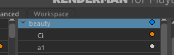
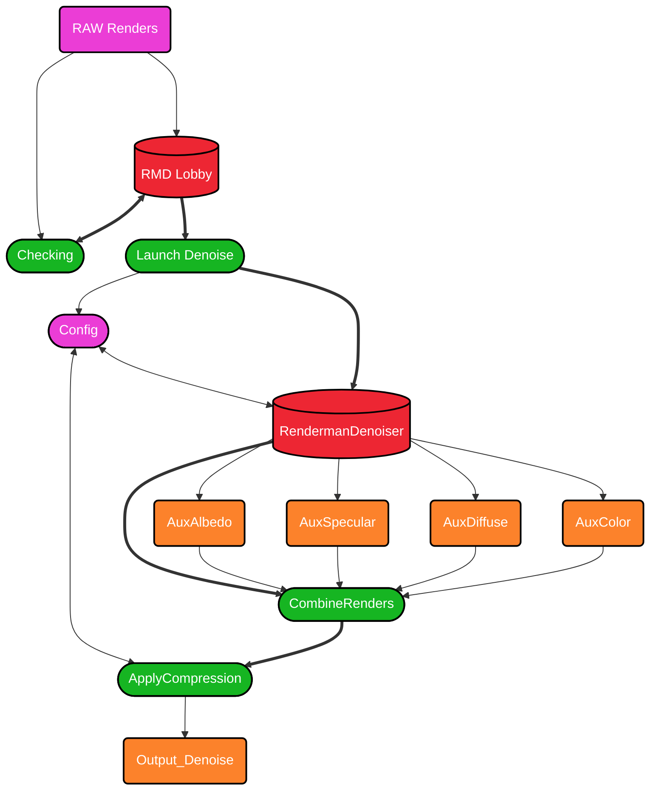

# Untitled

```
█▄▄▄▄ █▀▄▀█     ██▄   ▄███▄      ▄   ████▄ ▄█    ▄▄▄▄▄   ▄███▄                     
█  ▄▀ █ █ █     █  █  █▀   ▀      █  █   █ ██   █     ▀▄ █▀   ▀                    
█▀▀▌  █ ▄ █     █   █ ██▄▄    ██   █ █   █ ██ ▄  ▀▀▀▀▄   ██▄▄                      
█  █  █   █     █  █  █▄   ▄▀ █ █  █ ▀████ ▐█  ▀▄▄▄▄▀    █▄   ▄▀                   
  █      █      ███▀  ▀███▀   █  █ █        ▐            ▀███▀                     
 ▀      ▀                     █   ██                                               
                                                                                   
██▄   ████▄ ▄█▄      ▄   █▀▄▀█ ▄███▄      ▄     ▄▄▄▄▀ ██     ▄▄▄▄▀ ▄█ ████▄    ▄   
█  █  █   █ █▀ ▀▄     █  █ █ █ █▀   ▀      █ ▀▀▀ █    █ █ ▀▀▀ █    ██ █   █     █  
█   █ █   █ █   ▀  █   █ █ ▄ █ ██▄▄    ██   █    █    █▄▄█    █    ██ █   █ ██   █ 
█  █  ▀████ █▄  ▄▀ █   █ █   █ █▄   ▄▀ █ █  █   █     █  █   █     ▐█ ▀████ █ █  █ 
███▀        ▀███▀  █▄ ▄█    █  ▀███▀   █  █ █  ▀         █  ▀       ▐       █  █ █ 
                    ▀▀▀    ▀           █   ██           █                   █   ██ 
                                                       ▀                           
```

Writen by Quazar

RMD is an interface created in order to use the Renderman Denoiser, available since Renderman 25.

By default, using the Renderman Denoiser interface you will be able to denoise your frames / render but you won’t get all your AOV’s / LightGroup that you might need for your postprocessing.

RMD was created to fix this issue. You will be able to use the latest Renderman for Denoising and some features created to make your render files less heavy on your drive.

## 1 - INSTALL RM DENOISE

Before installing RM Denoise you will need python installed on your machine

⚠️ **Python compiler 3.12 at least**

[Welcome to Python.org](https://www.python.org/)

⚠️ **You will also need to install the Python (same version than for the main Python Compiler) application available in the Microsoft Store**

To install RM Denoise on your machine you can follow this link to find the project on Github

[GitHub - DelaporteRobin/RMD: Python project creating configuration files for Renderman 25 Denoiser in order to keep lighgroups and compress final renders .exr](https://github.com/DelaporteRobin/RMD)

You can install the RMD Folder downloaded where you want on your machine it has no importance.

I strongly advice you to launch the [RMD.py](http://RMD.py) file from a Shell, instead of clinking on it.

```powershell
C:\Users\Username\Desktop\RMD> python RMD.py
```

The first time you will launch [RMD.py](http://RMD.py) it will install all the packages you need in order to use the Denoiser

⚠️ **Note that you may need to restart [RMD.py](http://RMD.py) after installing python packages**

⚠️ **There is an issue with the main RMD interface that is due to the library used to created the Terminal User Interface Design, that was not fixed yet by the ones who created tis library, so  the fix for this issue for now is to install manually an older version of the library**

To do so please enter these two commands in a shell

```powershell
python -m pip uninstall textual
python -m pip install textual==0.70
```

## 2 - REQUIREMENTS BEFORE RENDERING

In order to be functional the Renderman Denoiser needs you to do a few things before rendering.

**You will need to add several AOV’s in your Renders**

In fact, to be able to detect where noise is more present in your image, and to have enough data to be able to denoise with maintaining a certain level of detail, Renderman needs a list of AOV’s to be present in your final .exr images.

You can find this AOV list on the Renderman website

[rmanwiki-26.pixar.com](https://rmanwiki-26.pixar.com/space/REN26/19661815/Denoiser+AOVs)

⚠️ **NOTE THAT ALL THESE AOV’S A REQUIRED TO DENOISE**

You will also need in order to denoise to **Uncheck** asRgba in the beauty section, in your AOV’s settings.




## 3 - RMD Worflow Diagram



## 4 - RMD INTERFACE


The RMD interface is splited in Two parts

- On the left side you will have all the options in order to setup your Denoise (input / output path, frame range, compression mode…)
- On the right side there is a log, displaying different kind of informations (Warning, Messages, Error) to keep you in touch of everything that is happening while you are using RMD
- 

⚠️ **Just below the RM Denoise title, you will find an Input Field with a Renderman path, make sure that this path is correct on your machine, and it is pointing to the right Renderman Version Folder!**

### INPUT / OUTPUT FOLDER

Here you will find two Directory Tree to define the folder containing your Input Sequence (Render frames before Denoise) and the folder where the Denoised frames will be saved

⚠️ **The Input folder must contain only the frames you want to Denoise and nothing else, also make sure that the Output folder is empty!**

⚠️ **Note that when you are selecting an Input folder it automatically set an Output folder near the Input folder**

**EXEMPLE**

**Input folder -** *C:/Users/Username/Desktop/project/images/render*

**Output folder** - *C:/Users/Username/Desktop/project/images/denoise_output*

Of course this automatic Output folder is overrided when you are selecting manually your Output folder.

### DENOISER SETTINGS

The first setting that you can change of course is the Frame Range you want to denoise, by default it is Unchecked so RMD will try to denoise all the images contained in the Input Folder.

The first thing to do is to press **Check Input Sequence**!

By calling this function you will check each images of the sequence you want to denoise. All the channels contained in each images of that sequence will be checked to see if everything that is needed is in the Render, and more especially if all images has the same channels!

After doing this you will have access to a **List Menu** containing the list of channels detected in your sequence.

By checking a channel you indicate to RMD that **you want it removed from the final Denoised Renders.**

Each AOV added in a Render doesn’t really add Render Time but the Rendered Images will be heavier. 

Because the Renderman Denoiser ask you to add a lot of AOV’s in addition to the ones you need for compositing (such as lightgroups), you final images might be quite heavy.

By selecting the Denoise AOV’s, after RMD Denoised your images, these AOV’s which are no longer useful will be deleted, and your denoised renders much lighter.

- By checking **Crossframe** your let Renderman denoise each images of the sequence by taking also in memory the previous images denoised, and the next ones, so you don’t have **Denoise Flickering** in your final images.
⚠️ **Note that you need at least 7 images in a sequence to be able to use Crossframe Denoising, otherwise the denoising will return an error.**
- By checking **Combine Renders** you enable RMD to combine Denoised Renders. By default Renderman will, for each image of the sequence, split it in 4 different images, each of them containing only specifics AOV’s (one for albedo, one for specular related AOV’s…).
Instead of this, if you want your denoised renders to be re-combined in 1 images per frame, let this feature checked.
- By checking **Remove Channels** you let RMD remove your selected channels from the Denoised Renders, and apply a compression to make your images even lighter.

RMD let you also pick a compression algorythm in that list:

DWAB, RLE, ZIP, ZIPS, PIZ, PXR24, B44, B44A, DWAA

Some of them are called lossless, which mean that pixels values doen’t change after the compression (the colors doesn’t change).

But after testing each of them on renders, lossless compression doesn’t reduce that much the weight of a render, because apparently a compression is already applied by Renderman after the Render.

To me the best choice is to use DWAB_Compression, it is not lossless, and there is a tiny difference of value in the pixels after denoising, but that difference is so tiny that when you look at the image as a whole it will be invisible.

It will not influence your grading step, or compositing in general, even if you apply extreme contrast/gamma/color correction values.

Here is a test, where I denoised the *test_render.exr* file and compressed it, testing all the compression algorythm.


You can see that for lossless compression, the size is not that far from the original file size.

You can even that the weight of the file is bigger sometime, if you are using B44A and B44 compression.

But you’ll also notice that if you are using DWAB compression, or DWAA compression, the file weight might be divided by more than 10, and despite the fact that it’s not lossless compression, the difference is invisible unless you isolate a pixel to make the comparison, or look directly at the numerical value of the colours of a pixel.

Don’t hesitate to add a star to the github repo, if you liked my project and if it was useful to you 🙂

Also, if you have any Bug / Problem, you can post an Issue directly on the github project and I will try my best to fix it or to give you a solution.